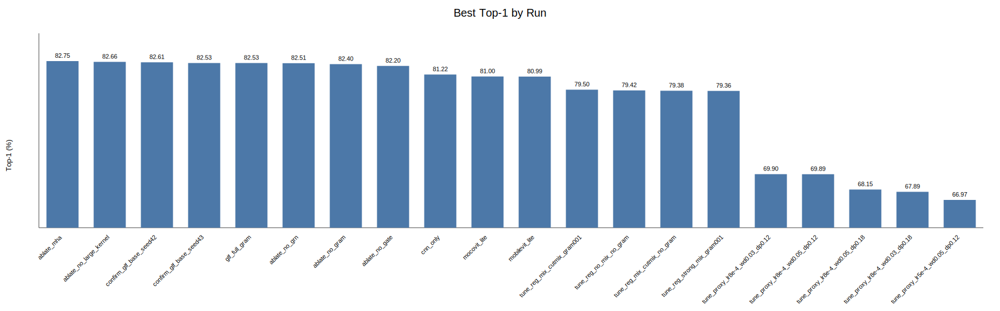
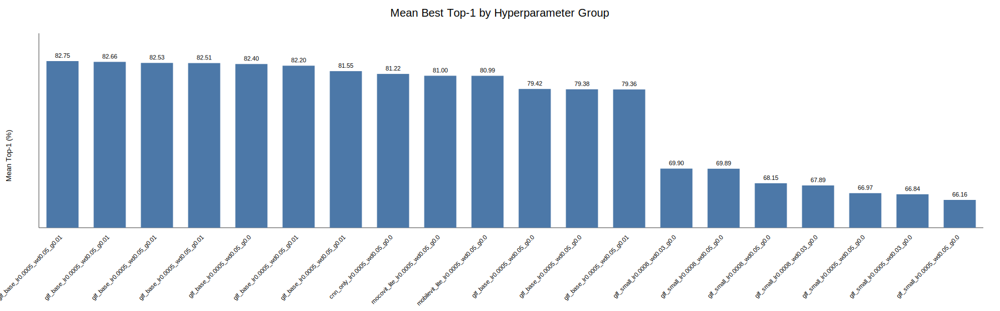
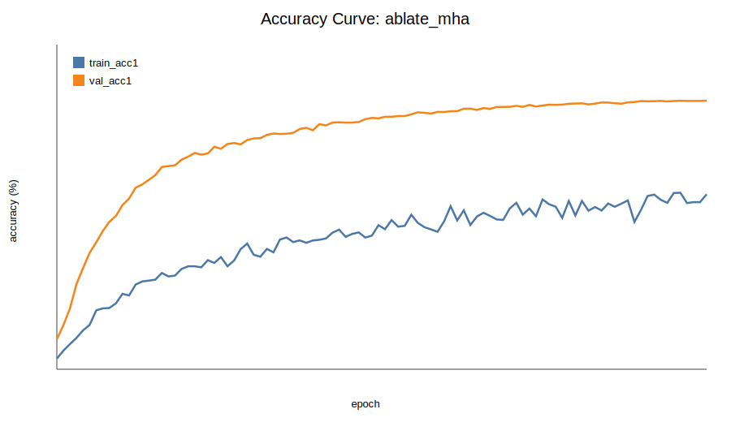

# GLF-MobileViT 实验复现说明

开源地址：[Maxer-007/glf-mobilevit-repro](https://github.com/Maxer-007/glf-mobilevit-repro)

本文件夹用于复现 GLF-MobileViT 的模型训练、参数调优、基线对比、消融实验、评估和可视化流程。根目录下的 `README.md` 用于说明实验环境、数据准备、运行方式和实验结果；实际代码、脚本和图表资源均放在同级的 `code/` 文件夹中。

## 文件结构

```text
glf-mobilevit-repro/
  README.md
  code/
    glf_mobilevit/
      __init__.py
      data.py                 # CIFAR 数据加载与增强
      losses.py               # Mixup、CutMix、Gram consistency 等损失
      models.py               # GLF-MobileViT、baseline 和消融模型
      utils.py                # 指标、FLOPs 估计、checkpoint 等工具
    scripts/
      local_smoke.ps1         # Windows 本地快速前向检查
      run_5090.sh             # RTX 5090 主模型训练
      tune_5090.sh            # 三阶段参数调优
      run_ablations_5090.sh   # baseline 与消融实验
      run_all_5090.sh         # 一键运行调参、消融和汇总
      summarize_results.py    # 汇总 log.csv 并生成表格和曲线
    assets/
      top1_by_run.svg         # 各实验 run 的 Top-1 对比图
      top1_by_group.svg       # 按实验组聚合后的 Top-1 对比图
      accuracy_curve_best.svg # 最优 run 的训练/验证曲线
    train.py                  # 训练入口
    eval.py                   # 测试集评估与吞吐测试
    visualize.py              # gate 与 attention 可视化
    smoke_test.py             # 随机输入快速检查
    requirements.txt          # Python 依赖
```

## 实验环境

推荐实验环境如下：

| 项目 | 配置 |
| --- | --- |
| 操作系统 | Linux / Windows 均可；完整训练推荐 Linux 远程服务器 |
| Python | Python 3.10 或更高版本 |
| GPU | NVIDIA RTX 5090，或其他支持 CUDA 的 NVIDIA GPU |
| 深度学习框架 | PyTorch + TorchVision |
| 主要依赖 | `torch`、`torchvision`、`numpy` |

安装依赖：

```bash
cd code
pip install -r requirements.txt
```

若远程环境已经预装 PyTorch，可先检查 CUDA 是否可用：

```bash
python -c "import torch; print(torch.__version__, torch.cuda.is_available())"
```

## 数据集下载

实验使用 CIFAR-100 图像分类数据集。以下命令默认在 `code/` 目录下执行，默认数据目录为：

```text
data/
```

方式一：由 TorchVision 自动下载。训练脚本默认启用 `--download`，首次运行时会自动下载 CIFAR-100：

```bash
python train.py --dataset cifar100 --data-dir data --model glf_tiny --img-size 64 --epochs 1 --batch-size 8
```

方式二：手动准备数据集。可从 CIFAR-100 官方地址下载：

```text
https://www.cs.toronto.edu/~kriz/cifar-100-python.tar.gz
```

下载后放置为：

```text
data/cifar-100-python.tar.gz
```

或解压为：

```text
data/cifar-100-python/
```

若服务器不能联网，建议先在本地下载数据集，再上传到远程服务器的 `data/` 目录。

## 运行方式

除特别说明外，本节命令均在 `code/` 目录下执行：

```bash
cd code
```

本地快速检查模型构建和前向传播：

```bash
python smoke_test.py --model glf_tiny --img-size 64 --batch-size 2 --skip-flops
```

Windows PowerShell 也可运行：

```powershell
.\scripts\local_smoke.ps1
```

在 RTX 5090 上训练完整 GLF-MobileViT 主模型：

```bash
bash scripts/run_5090.sh
```

按 GLF-MobileViT 完整实验流程一键运行参数调优、基线对比、消融实验和结果汇总：

```bash
bash scripts/run_all_5090.sh
```

该脚本等价于依次执行：

```bash
bash scripts/tune_5090.sh all
bash scripts/run_ablations_5090.sh
python scripts/summarize_results.py --runs-dir runs --output-dir results
```

也可以分阶段单独运行：

```bash
# 12 组 proxy 超参数搜索
bash scripts/tune_5090.sh proxy

# 4 组正则化策略调参
bash scripts/tune_5090.sh regularization

# 2 个随机种子的最终复验
bash scripts/tune_5090.sh confirm

# baseline 与消融实验
bash scripts/run_ablations_5090.sh

# 汇总已有实验结果
python scripts/summarize_results.py --runs-dir runs --output-dir results
```

### 运行日志与输出文件

训练输出默认保存在：

```text
runs/<run-name>/
```

每个实验 run 会保存以下文件：

| 文件 | 内容 |
| --- | --- |
| `config.json` | 本次实验的模型、数据集、训练轮数、batch size、学习率、正则化等完整配置 |
| `model_summary.json` | 模型参数量、FLOPs 估计和模型名称 |
| `log.csv` | 每个 epoch 的学习率、训练损失、训练 Top-1/Top-5、验证损失、验证 Top-1/Top-5 和历史最优结果 |
| `best.pt` | 验证集 Top-1 最优 checkpoint |
| `latest.pt` | 最近一次保存的 checkpoint，可用于断点恢复 |

若需要保存终端输出日志，可在远程服务器上使用：

```bash
mkdir -p logs
nohup bash scripts/run_all_5090.sh > logs/all_experiments.log 2>&1 &
```

此时 `logs/all_experiments.log` 保存终端打印信息，例如当前 run 名称、模型规模、step 级训练进度和异常信息；`runs/<run-name>/log.csv` 保存结构化 epoch 指标，适合后续画图和统计分析。

结果汇总默认保存在：

```text
results/
```

主要包括 `summary.csv`、`group_summary.csv`、`conclusions.md` 和 `charts/` 下的可视化曲线。

完成训练后，可对最佳 checkpoint 进行评估：

```bash
python eval.py \
  --model glf_base \
  --checkpoint runs/glf_base_cifar100_224_gram/best.pt \
  --dataset cifar100 \
  --data-dir data \
  --img-size 224 \
  --batch-size 128 \
  --amp \
  --channels-last \
  --benchmark
```

可视化 gate 与 attention：

```bash
python visualize.py \
  --model glf_base \
  --checkpoint runs/glf_base_cifar100_224_gram/best.pt \
  --dataset cifar100 \
  --data-dir data \
  --img-size 224
```

## 实验结果

以下结果来自 RTX 5090 上完成的 CIFAR-100 实验，输入分辨率为 `224x224`，主要训练设置为 AdamW、cosine schedule、Mixup、CutMix、label smoothing、random erasing 和 AMP。

### 主要模型结果

| 模型 | Top-1 (%) | Top-5 (%) | 参数量 (M) | FLOPs (G) | 说明 |
| --- | ---: | ---: | ---: | ---: | --- |
| GLF-MobileViT，2-seed 平均 | 82.57 | 96.18 | 7.24 | 3.73 | 最终复验结果，seed=42/43 |
| GLF-MobileViT，单 seed | 82.53 | 96.04 | 7.24 | 3.73 | 完整模型单次训练 |
| CNN-only | 81.22 | 95.68 | 6.55 | 3.11 | 去除 Transformer 分支 |
| MobileViT-lite | 80.99 | 95.93 | 4.25 | 3.00 | 轻量 MobileViT 风格基线 |
| MoCoViT-lite | 81.00 | 95.70 | 4.00 | 2.95 | 轻量 MoCoViT 风格基线 |

### 主要模型 Top-1 对比图



### 分组结果对比图



### 最优模型训练曲线



### 消融实验结果

| 消融设置 | Top-1 (%) | Top-5 (%) | 参数量 (M) | FLOPs (G) |
| --- | ---: | ---: | ---: | ---: |
| GLF-MobileViT full | 82.53 | 96.04 | 7.24 | 3.73 |
| 替换为普通 MHA | 82.75 | 96.07 | 7.75 | 3.83 |
| 去除大核卷积分支 | 82.66 | 96.32 | 7.04 | 3.53 |
| 去除 GRN | 82.51 | 96.39 | 7.22 | 3.73 |
| 去除门控融合 | 82.20 | 96.02 | 7.24 | 3.57 |
| 去除 Gram consistency | 82.40 | 96.31 | 7.24 | 3.73 |

### 参数调优结果

| 阶段 | 设置 | 主要结果 |
| --- | --- | --- |
| proxy 搜索 | `glf_small`、`160x160`、12 组、30 epoch | `lr=8e-4, weight_decay=0.03, drop_path=0.12` 的 proxy Top-1 最高，为 69.90% |
| 正则化调参 | `glf_base`、`224x224`、4 组、60 epoch | Mixup + CutMix + Gram consistency 在 60 epoch 下 Top-1 为 79.50%，为该阶段最高 |
| 最终复验 | `glf_base`、`224x224`、2 seeds、100 epoch | seed 42/43 的 Top-1 分别为 82.61% 和 82.53%，平均为 82.57% |

### 结果文件说明

重新生成实验汇总表和曲线：

```bash
python scripts/summarize_results.py --runs-dir runs --output-dir results
```

| 文件 | 内容 |
| --- | --- |
| `results/summary.csv` | 每个 run 的超参数、最优 epoch、Top-1、Top-5、loss、参数量和 FLOPs |
| `results/group_summary.csv` | 按实验组聚合后的均值、标准差和最大值 |
| `results/conclusions.md` | 自动生成的实验结论草稿 |
| `results/charts/top1_by_run.svg` | 各 run 的 Top-1 对比图 |
| `results/charts/top1_by_group.svg` | 分组后的 Top-1 对比图 |
| `results/charts/accuracy_curve_best.svg` | 最优 run 的训练/验证精度曲线 |

